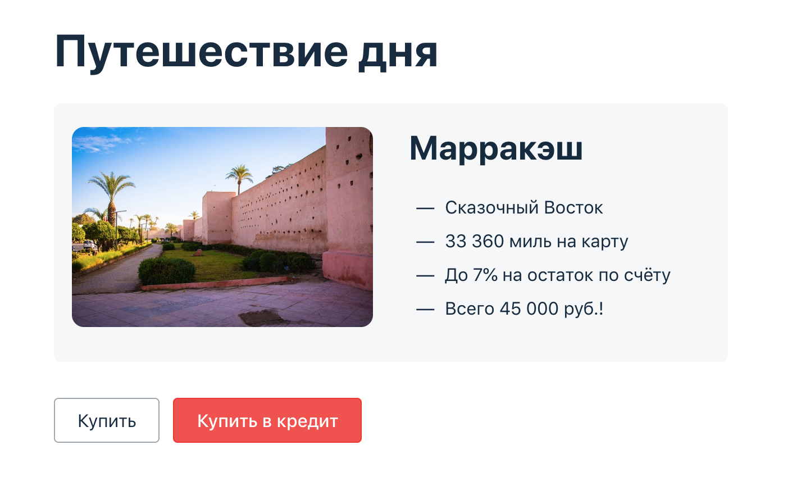

# Diploma

### DOCUMENTATION
[План автоматизации тестирования](https://github.com/Kasparidi/Diploma/blob/master/documentation/Plan.md)
### DESCRIPTION
Дипломный проект представляет собой автоматизацию тестирования комплексного сервиса, взаимодействующего с СУБД и 
API Банка.

Приложение представляет из себя веб-сервис. Предлагает купить тур с помощью дебетовой карты и в кредит.
Данные по картам пересылаются банковским сервисам.

### TASK
Приложение должно сохранять информацию о способе и успешности оплаты в СУБД MySQL и PostgreSQL.

### LAUNCH
#### MySQL
1. Открыть Intellij IDEA
1. Склонировать репозиторий: ``git clone https://github.com/Kasparidi/Diploma``
1. Запустить контейнеры: ``docker-compose -f docker-compose-ms.yml up -d``
1. Запустить SUT: ``java -Ddb.url=jdbc:mysql://localhost:3306/app -Dlogin=app -Dpassword=pass -jar artifacts/aqa-shop.jar``
1. Запустить тесты с отчетом Allure: ``gradlew clean test -Ddb.url=jdbc:mysql://localhost:3306/app allureReport``
1. Посмотреть отчет Allure в браузере `` gradlew allureServe``
1. Остановить контейнеры ``docker-compose -f docker-compose-ms.yml down``
1. Доступно в браузере http://localhost:8080/

#### PostgreSQL
1. Открыть Intellij IDEA
1. Склонировать репозиторий: ``git clone https://github.com/Kasparidi/Diploma``
1. Запустить docker ``docker-compose -f docker-compose-ps.yml up -d``
1. Запустить SUT: ``java -Ddb.url=jdbc:postgresql://localhost:5432/app -Dlogin=app -Dpassword=pass -jar artifacts/aqa-shop.jar``
1. Запустить тесты с отчетом Allure: ``gradlew clean test -Ddb.url=jdbc:postgresql://localhost:5432/app allureReport``
1. Посмотреть отчет Allure в браузере `` gradlew allureServe``   
1. Остановить контейнеры ``docker-compose -f docker-compose-ps.yml down``   
1. Доступно в браузере http://localhost:8080/

