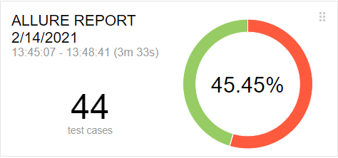

## Отчет по итогам тестирования
### Краткое описание
Проведено тестирование комплексного сервиса, взаимодействующего с СУБД и API Банка.
Были задействованы все инструменты, заявленные в [Плане автоматизации тестирования](https://github.com/Kasparidi/Diploma/blob/master/documentation/Plan.md).

### Количество тест-кейсов
* Итого: 44
* Успешные: 20
* Неуспешные: 24

  
### Общие рекомендации
* Реализовать появление сообщения об ошибку при оплате невалидной картой.
* Убрать возможность отправлять в поле "Месяц" нулевое значение.
* Поработать над вводом фамилии, имени в поле "Владелец".
* Исправить возможность нулевого ввода в поле "CVC/CVV".
* Нелогичные ошибки в парной работе полей "Владелец" и "CVC/CVV".
* Убрать возможность оплаты картой сроком действия свыше 5ти лет.
* Исправить синтаксическую ошибку на самом видном месте.
